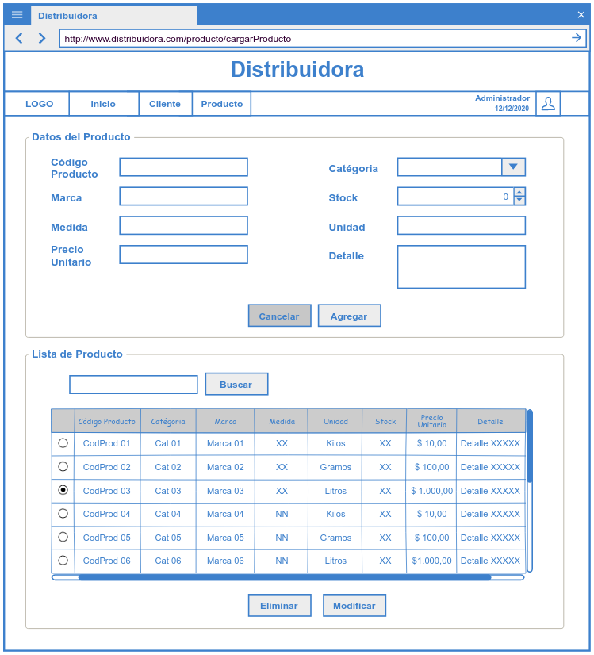
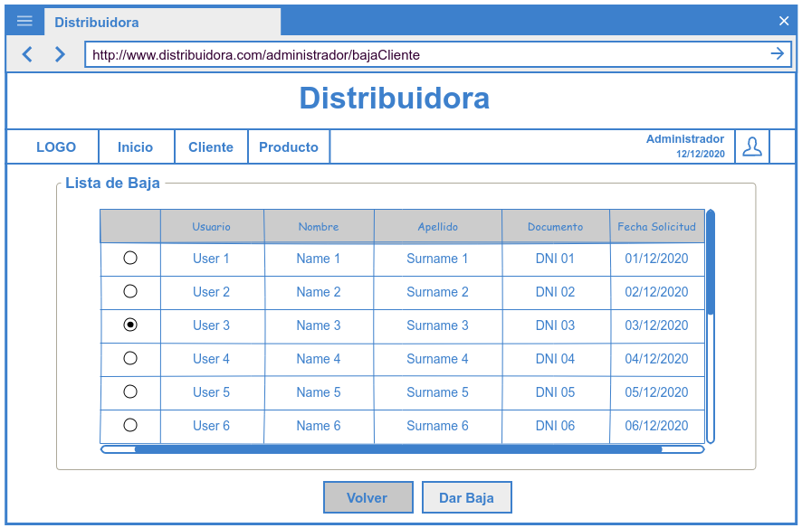
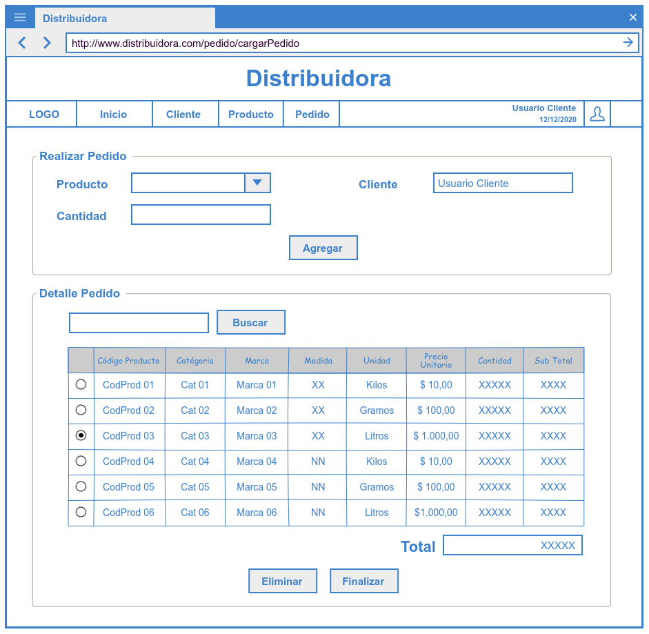
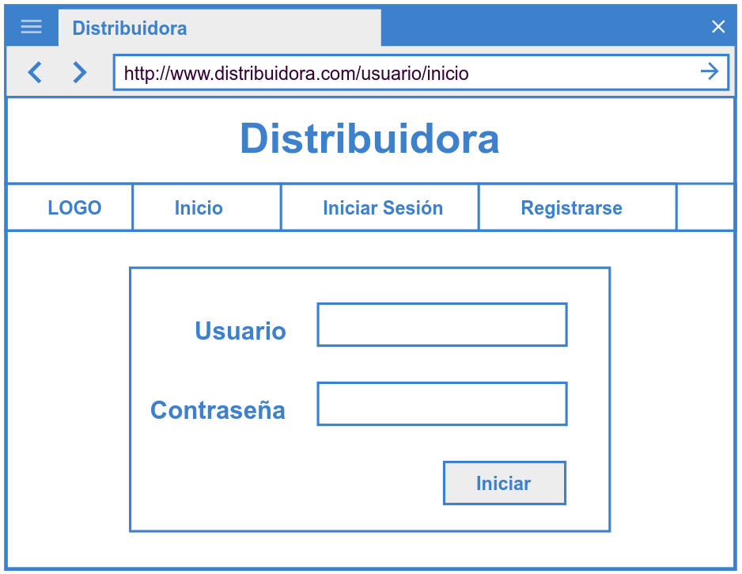
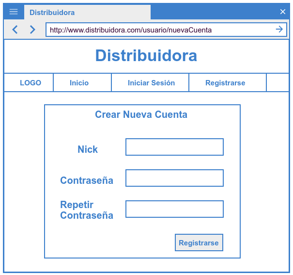
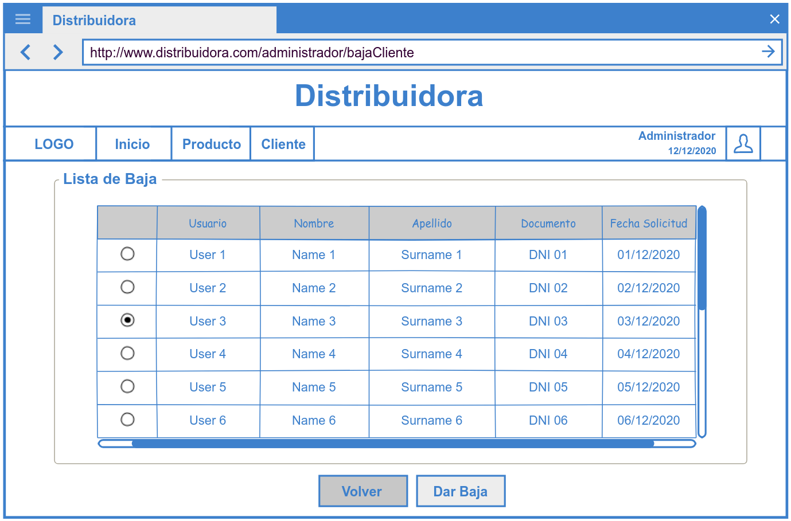

<h1> Especificación de Requisitos de Software </h1>
 
<h2> Enunciado del problema</h2>

El problema  que pretende solucionar el sistema es que debido a la cuarentena muchas empresas que atendían en persona ya no pueden hacerlo más, debido a esto tienen severos problemas para llevar una correcta gestión de sus pedidos ya que los hacen por WhatsApp y controlan a mano.

<h2> Clientes potenciales</h2>

 Todas Empresas o Entidades relacionada a la venta y distribución de producto alimenticio.

<h2> Solución propuesta</h2>

 <h3> Requisitos Funcionales</h3>
 

 * Permitir registrar, modificar y borrar un producto.

 * Permitir registrar, modificar y borrar las fecha y horas de los pedidos en el sistema.

 * Permitir registrar, modificar y borrar un detalle del pedido de producto.

 * Permitir registrar, modificar y borrar un cliente en el sistema.

 * Permitir un proceso inteligente, el cual se realizará descuento de producto al cliente. 

 <h3>Requisitos No Funcionales </h3> 

 * Este módulo debe registrar, modificar y borrar los datos de usuario.
 

 
 <h3> Historia de Usuario</h3>
 

   <h4>Gestión de Producto</h4>
   
   ***Alta Producto***
   
   <li>[HU-01] Crear Producto</li>   
   <li>[HU-02] Cargar Datos del Producto</li>   
   <li>[HU-13] Confirmar Alta de Producto</li>
    
   
   ***Modificar Producto***
   
   <li>[HU-03] Seleccionar Producto</li>   
   <li>[HU-04] Modificar Datos del Producto</li>   
   <li>[HU-14] Confirmar Modificaci&oacute;n de Producto</li>
    
   
   ***Baja de Producto***
   
   <li>[HU-05] Seleccionar Producto</li>   
   <li>[HU-06] Eliminar Producto</li>   
   <li>[HU-15] Confirmar Baja de Producto</li>
   
   <h4>Gestión de Cliente</h4>

   ***Alta de Cliente***
   
   <li>[HU-07] Crear Cliente</li>   
   <li>[HU-08] Cargar Datos Personales</li>
   <li>[HU-16] Confirmar Alta de Cliente</li>
    
   
   ***Modificación de Cliente***
   
   <li>[HU-09] Seleccionar Modificación</li>
   <li>[HU-10] Modificar Datos Personales</li>
   <li>[HU-17] Confirmar Modificaci&oacute;n de Cliente</li>
     
    
   ***Baja de Cliente***
   
   <li>[HU-11] Solicitar Baja Cliente</li>
   <li>[HU-12] Confirmar Baja Cliente</li>
    
   
   <h4>Gestión de Pedido</h4>
  
   ***Alta Pedido***
   
   <li>[HU-18] Crear Pedido</li>
   <li>[HU-19] Cargar Datos Pedido</li>
   <li>[HU-20] Confirmar Alta de Pedido</li> 
    
   
   ***Modificación de Pedido***
   
   <li>[HU-21] Seleccionar Pedido</li>
   <li>[HU-22] Modificar Datos Pedido</li>
   <li>[HU-23] Confirmar Datos Pedido</li>
    
   
   ***Baja de Pedido***
   
   <li>[HU-24] Solicitar Baja Pedido</li>
   <li>[HU-25] Confirmar Baja Pedido</li>
    
   
   <h4>Gestión de DetallePedido</h4>
   
   ***Alta de Detalle Pedido***
   
   <li>[HU-26] Crear Detalle de Pedido</li>
   <li>[HU-27] Cargar Datos de Detalle de Pedido</li>
   <li>[HU-28] Confirmar Alta de Detalle de Pedido</li>
    
   
   ***Modificación de Detalle Pedido***
   
   <li>[HU-29] Seleccionar Modificación de Detalle de Pedido</li>
   <li>[HU-30] Modificar Datos de Detalle de Pedido</li>
   <li>[HU-31] Confirmar Modificaci&oacute;n de Detalle de Pedido</li>
    
   
   ***Baja de Detalle Pedido***
   
   <li>[HU-32] Baja de un Detalle de Pedido</li>
   <li>[HU-33] Confirmar Baja de un Detalle Pedido</li>
    
   
   <h4>Gestión de Cliente Preferencial</h4>
   
   ***Alta de Cliente Preferencial***
   
   <li>[HU-34] Crear Cliente Preferencial</li>
   <li>[HU-35] Cargar Datos Cliente Preferencial</li>
   <li>[HU-36] Confirmar Alta de Cliente Preferencial</li>
    
   
   ***Actualización de Cliente Preferencialo***
   
   <li>[HU-37] Actualizar Cliente Preferencial</li>
   <li>[HU-38] Actualizar Datos de Cliente Preferencial</li>
   <li>[HU-39] Confirmar Actualizaci&oacuta;n de Cliente Preferencial</li>
    
   
   <h4>Gestión de Usuario</h4>
 
   ***Alta de Usuario***
   
   <li>[HU-40] Crear Usuario</li>
   <li>[HU-41] Cargar Datos de Usuario</li>
   <li>[HU-42] Confirmar Alta de Usuario</li>
    
   
   ***Modificación de Usuario***
   
   <li>[HU-43] Modificar Usuario</li>
   <li>[HU-44] Modificar Datos de Usuario</li>
   <li>[HU-45] Confirmar Modificaci&oacute;n de Usuario</li>
    
   
   ***Baja de Usuario***
   
   <li>[HU-46] Baja de Usuario</li>
   <li>[HU-47] Confirmar Baja de Usuario</li>
   <li>[HU-48] Aceptar Baja de Usuario</li>
    
 

<h2> Arquitectura de software</h2>

Sera una aplicación web basado en java que se ajustará a la arquitectura de software Cliente-Servidor

* **Base de Datos:** Postresql 4.25.

* **Framework:** Javalin.

* **Herrramienta de Diseño:** Miro, Pencil Project, Visual Paradigm 16.2. 

* **Herramienta de Gestión:** Maven.

* **Lenguaje:** CSS, Html, Java 14.

* **Librería:** Bootstrap 4.5.3, sql2o.

* **Testing:** Junit, Postman.

<h2> Wireframe</h2>

>La herramienta para los bocetos de interfaces se usará el **Pencil Project**.
 

<h4>Pantalla ABM del Producto</h4>

  
<h4>Pantalla ABM del Cliente</h4>

  
<h4>Pantalla Aprobar Baja del Cliente</h4>

  

<h4>Pantalla ABM del Pedido y Detalle Pedido</h4>

 

<h4>Pantalla Sesi&oacute;n</h4>

  

<h4>Pantalla ABM del Usuario</h4>

  

  
