# Diseño Orientado a Objeto

<h2>Diagrama de Secuencia del Sistema</h2>

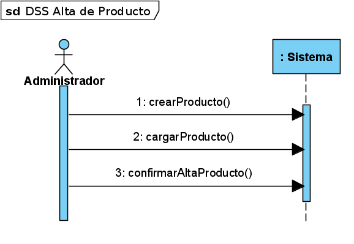

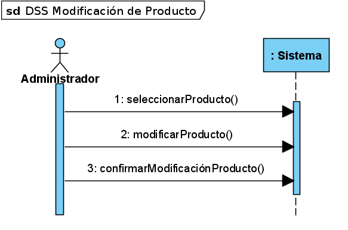

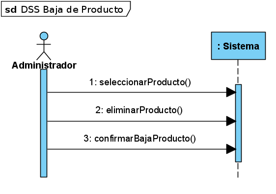

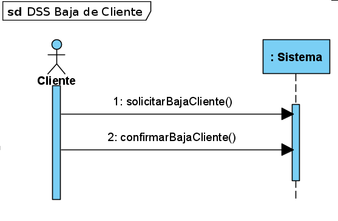

<h2>Modelo de Dominio</h2>

# Backlog de Iteración

<h2>Mapa de Historia de Usuario</h2>
 
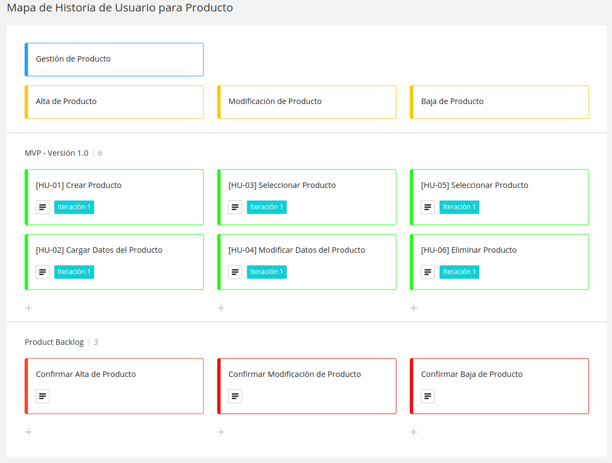
 
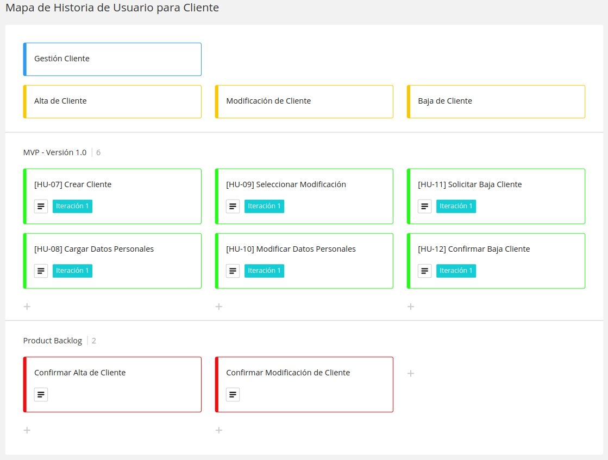

# Tareas
<h2>Gestión de Producto</h2>
<h4>Alta de Producto</h4>

 
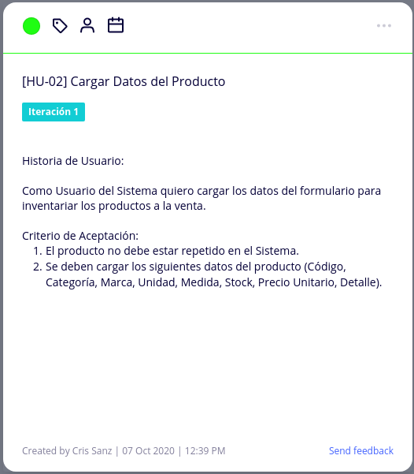
 
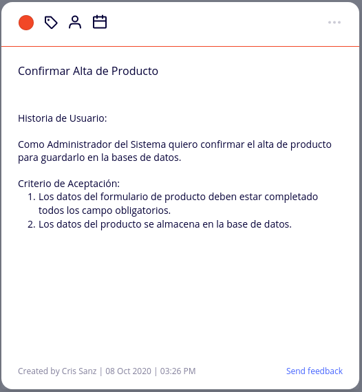
 
<h4>Modificación de Producto</h4>

 
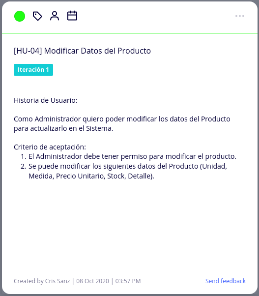
 
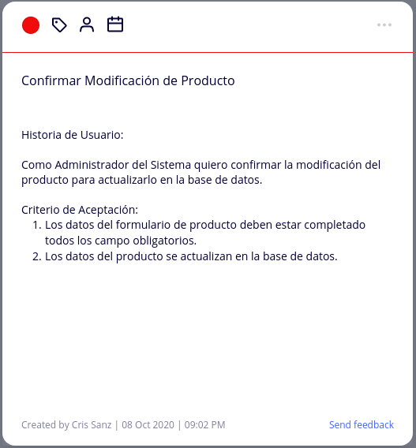
 
<h4>Baja de Producto</h4>
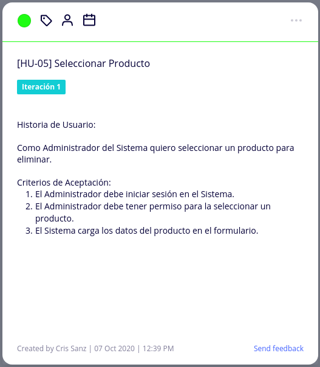
 
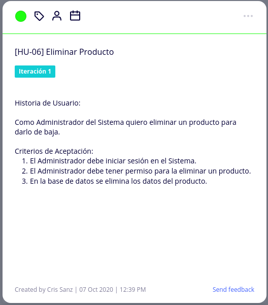
 
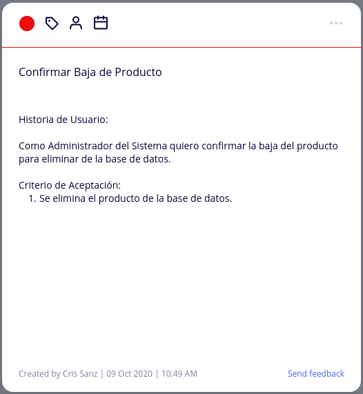
 

<h2>Gestión de Cliente</h2>
<h4>Alta de Cliente</h4>
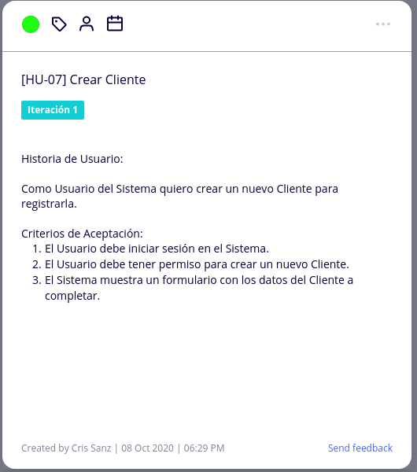
 

 

 
<h4>Modificación de Cliente</h4>

 
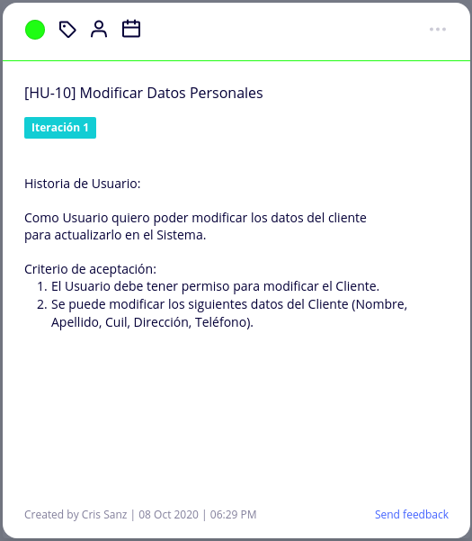
 

 
<h4>Baja de Cliente</h4>
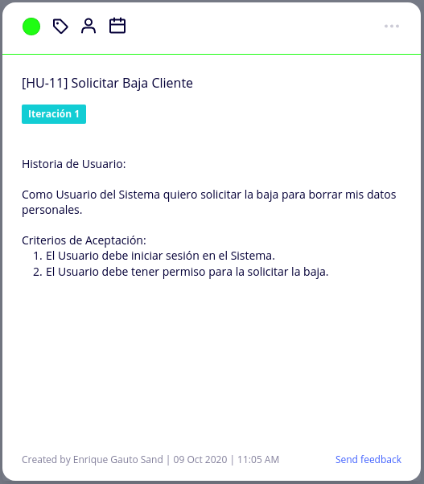
 

 
