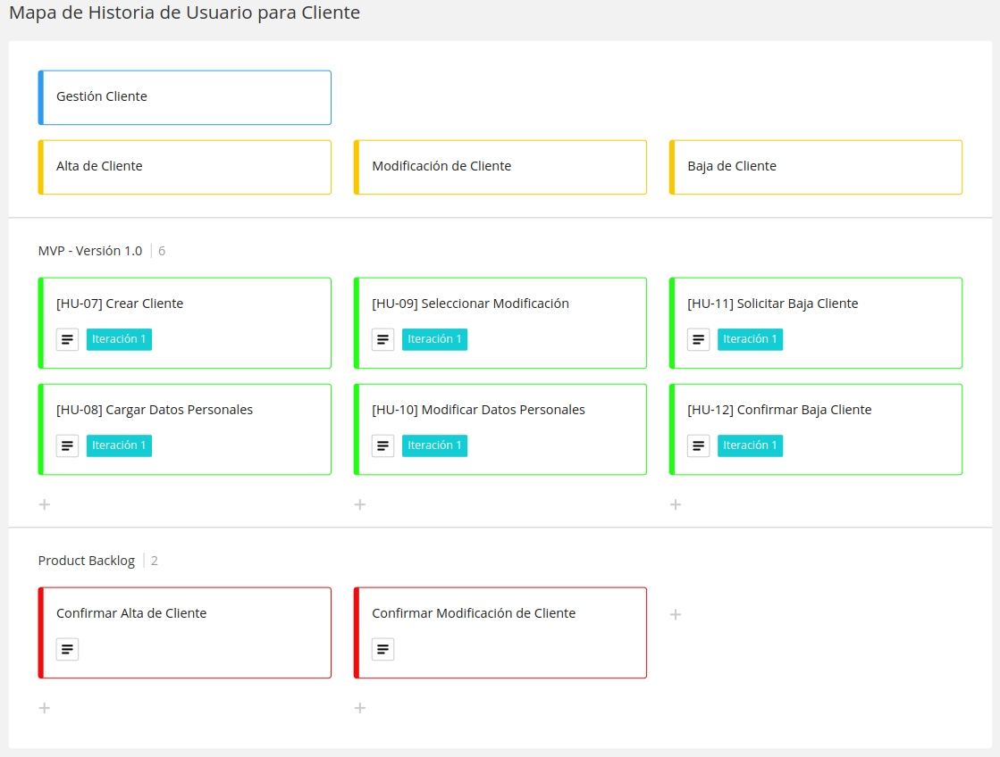
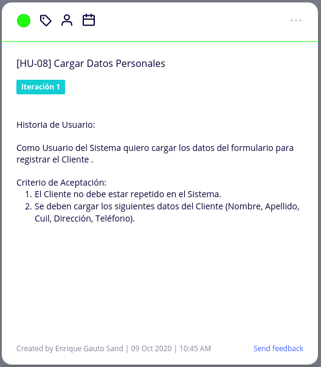

# Diseño Orientado a Objeto

<h2>Modelo de Dominio</h2>

<h2>Modelo de CRC</h2>
 
<table>
  <tr>
    <th colspan="2">Producto</th>
  </tr>
  <tr>
    <th>Responsabilidades</th>
    <th>Colaboradores</th>
  </tr>
  <tr>
    <th align= "left">
        - Crear Producto  
        - Cargar Datos del producto  
        - Seleccionar Producto  
        - Modificar Datos del producto  
        - Eliminar Producto  
    </th>
    <th>-------</th>
  </tr>
</table>
 
<table>
  <tr>
    <th colspan="2">Cliente</th>
  </tr>
  <tr>
    <th>Responsabilidades</th>
    <th>Colaboradores</th>
  </tr>
  <tr>
    <th align= "left">
      - Crear Cliente  
      - Cargar Datos Personales  
      - Seleccionar Modificar  
      - Modificar Datos Personales  
      - Solicitar Baja Cliente  
      - Confirmar Baja Cliente  
    </th>
    <th>-------</th>
  </tr>
</table>
 

# Backlog de Iteración

<h2>Mapa de Historia de Usuario</h2>
 

 

 

# Tareas
<h2>Gestión de Producto</h2>
<h4>Alta de Producto</h4>
 

 

 

  

<h4>Modificación de Producto</h4>
 

 

 

  

<h4>Baja de Producto</h4>
 

 

 

 

<h2>Gestión de Cliente</h2>
<h4>Alta de Cliente</h4>
 

 

 

  

<h4>Modificación de Cliente</h4>
 

 

 

  

<h4>Baja de Cliente</h4>
 

 

 
