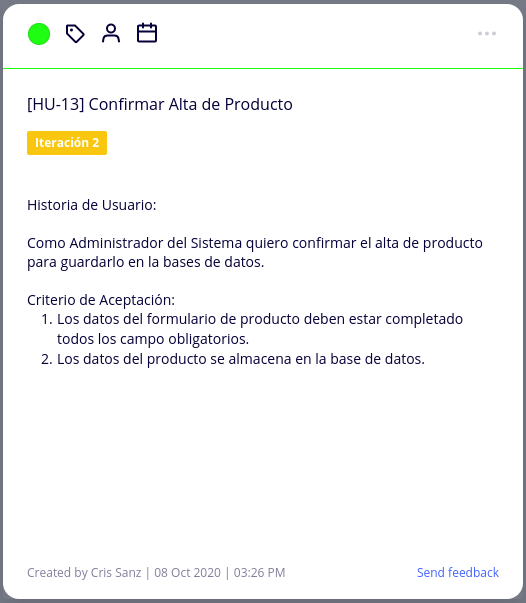
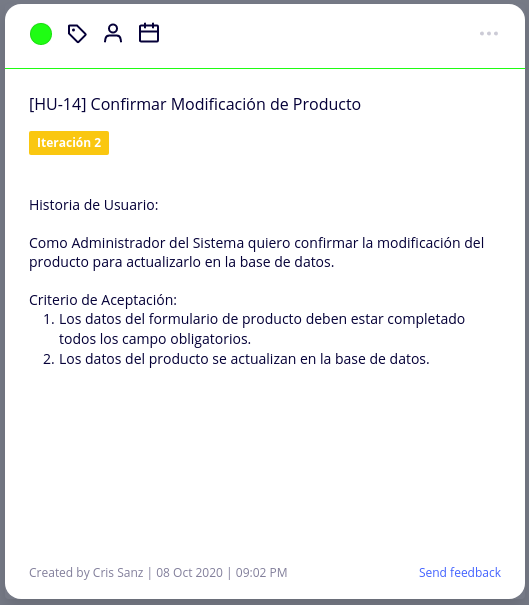
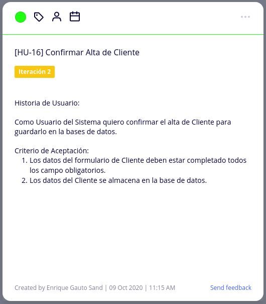
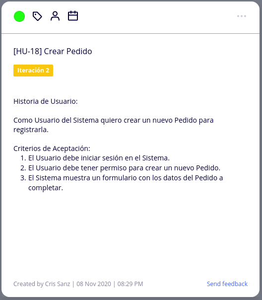
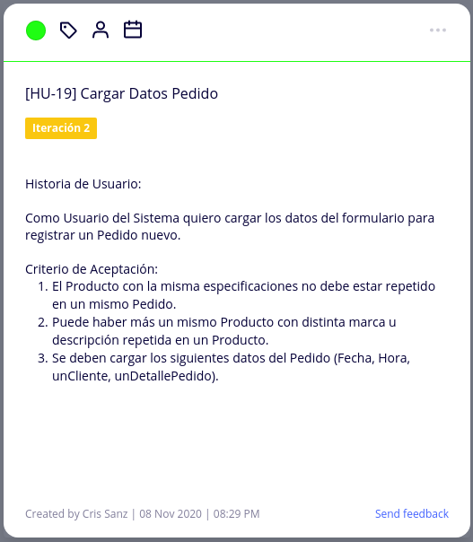

# Diseño Orientado a Objeto

<h2>Modelo de Dominio</h2>

# Backlog de Iteración

<h2>Mapa de Historia de Usuario</h2>
 

 

 

 

 

# Tareas
<h2>Gestión de Producto</h2>
<h4>Alta de Producto</h4>
 

  

<h4>Modificación de Producto</h4>
 

  

<h4>Baja de Producto</h4>
 

  

<h2>Gestión de Cliente</h2>
<h4>Alta de Cliente</h4>
 

  

<h4>Modificación de Cliente</h4>
 

  

<h2>Gestión de Pedido</h2>
<h4>Alta de Pedido</h4>
 

 

 

  

<h4>Modificación de Pedido</h4>
 

<h4>Baja de Pedido</h4>
 

<h2>Gestión de Detalle Pedido</h2>
<h4>Alta de Detalle Pedido</h4>
 

<h4>Modificación de Detalle Pedido</h4>
 

<h4>Baja de Detalle Pedido</h4>
 

