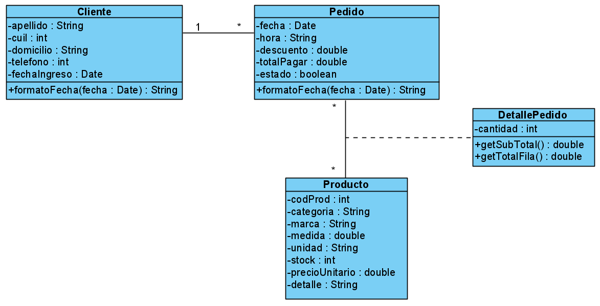
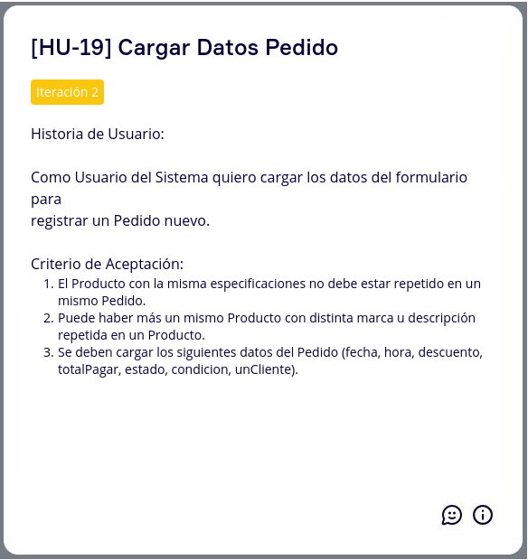
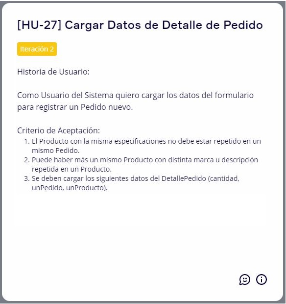
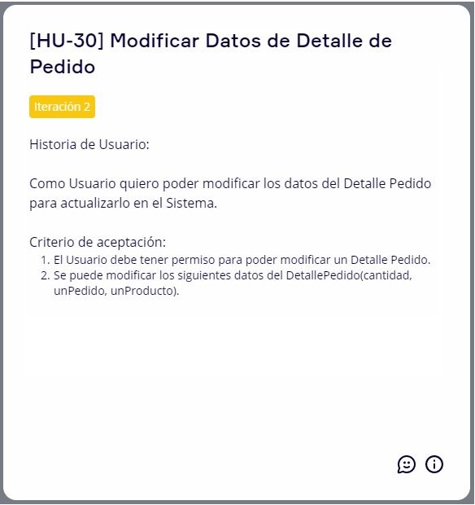

# Diseño Orientado a Objeto - Iteración N° 2

<h2>Modelo de Dominio</h2>

 

# Backlog de Iteración

<h2>Mapa de Historia de Usuario</h2>
 

 

 

 

 

# Historia de Usuario
<h2>Gestión de Producto</h2>
<h4>Alta de Producto</h4>
 

  

<h4>Modificación de Producto</h4>
 

  

<h4>Baja de Producto</h4>
 

  

<h2>Gestión de Cliente</h2>
<h4>Alta de Cliente</h4>
 

  

<h4>Modificación de Cliente</h4>
 

  

<h2>Gestión de Pedido</h2>
<h4>Alta de Pedido</h4>
 

 

 

  

<h4>Modificación de Pedido</h4>
 

 

 

  

<h4>Baja de Pedido</h4>
 

 

  

<h2>Gestión de Detalle Pedido</h2>
<h4>Alta de Detalle Pedido</h4>
 

 

 

  

<h4>Modificación de Detalle Pedido</h4>
 

 

 

  

<h4>Baja de Detalle Pedido</h4>
 

 

  

# Tareas

* Crear las tablas **Pedido** y **Detalle Pedido** en la BD.

* Crear el **Modelo**, **Repositorio** y **Controlador** de *Pedido* y *Detalle Pedido*.

* Crear la Vista de *Pedido* y *Detalle Pedido*.

* Actualizar el **Repositorio** y **Controlador** del *Cliente* y *Producto*.

# Corrección de Archivo Anteriores

* Se corrigió el Modulo Cliente al cual se le agregó la fecha de ingreso.

* La fecha de ingreso del cliente se implemento en la codificación.

* Se modificarón las Historia de Usuario Cliente en la cuál incluían la fecha de ingreso.
