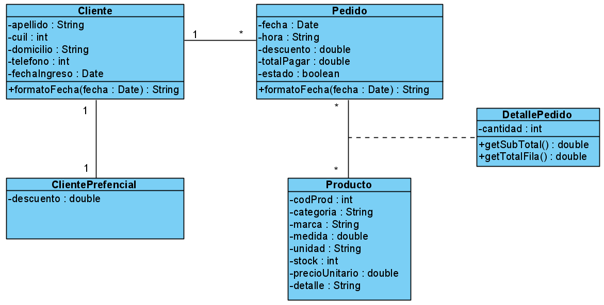
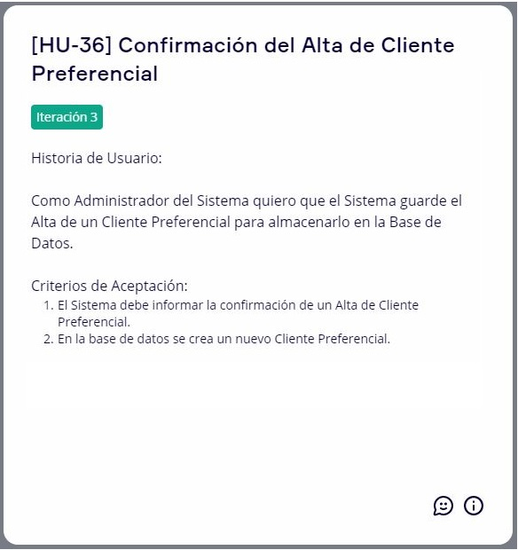
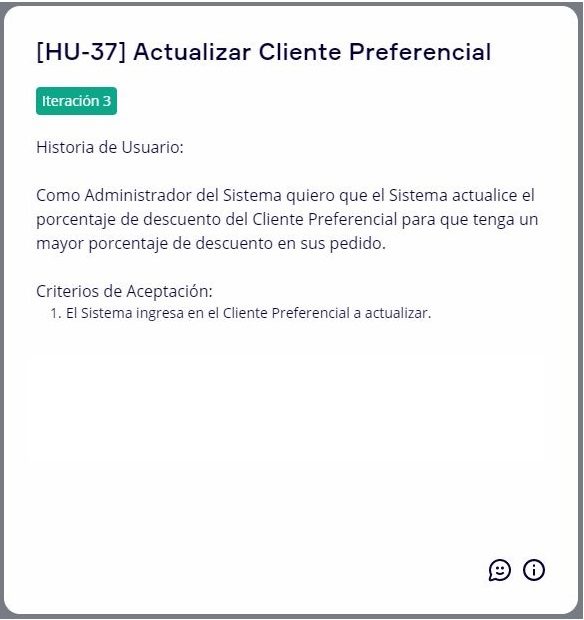

# Diseño Orientado a Objeto - Iteración 3

<h2>Modelo de Dominio</h2>

 

# Backlog de Iteración

<h2>Mapa de Historia de Usuario</h2>
 

 

# Historia de Usuario

<h2>Gestión de Cliente Preferencial</h2>

<h4>Alta de Cliente Preferencial</h4>
 

 

 

  

<h4>Actualización de Cliente Preferencial</h4>
 

 

 

  

# Tareas

* Crear las tablas **Cliente Preferencial** en la BD.

* Crear el **Modelo**, **Repositorio** y **Controlador** del *Cliente Preferencial*.

* Actualizar el **Repositorio** y **Controlador** del *Cliente*.

# Corrección de Archivo Anteriores

* Se agregó el estado al Moduló de Pedido y se corrigen en la Historia de Usuario y Codificación de Pedido.

* Se corrigió la redacción de la Historia de Usuario de Pedido.

* Se han modificado el Modelo de Dominio de la Tabla de DetallePedido. 
