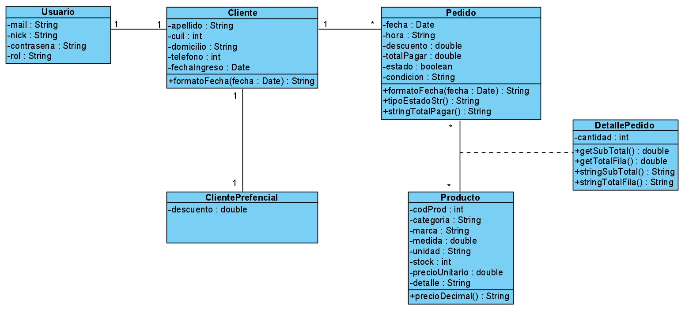

# Diseño Orientado a Objeto - Iteración 4

<h2>Modelo de Dominio</h2>

 

# Backlog de Iteración

<h2>Mapa de Historia de Usuario</h2>
 

 

# Historia de Usuario

<h2>Gestión de Usuario</h2>

<h4>Alta de Usuario</h4>
 

 

 

  

<h4>Modificaci&oacute;n de Usuario</h4>
 

 

 

  

<h4>Baja de Usuario</h4>
 

 

 

  

# Tareas

* Crear las tablas **Usuario** en la BD.

* Crear el **Modelo**, **Repositorio** y **Controlador** del *Usuario*.

* Actualizar el **Repositorio** y **Controlador** del *Cliente*.
